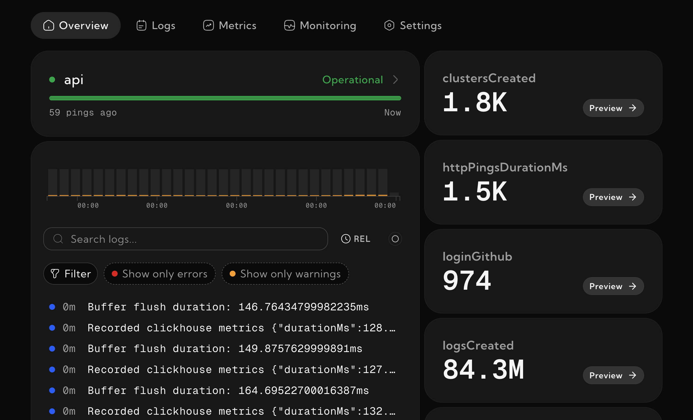

# @logdash/node

Logdash is how SaaS founders keep their apps healthy. This package serves a NodeJS/Bun/Deno interface to use it.

## Pre-requisites

Setup your free project in less than 2 minutes at [logdash.io](https://logdash.io/)

## Installation

```
npm install @logdash/node
```

## Logging

```typescript
import { Logdash } from '@logdash/node';

const logdash = new Logdash('<your-api-key>');

logdash.info('Application started successfully');
logdash.error('An unexpected error occurred');
logdash.warn('Low disk space warning');
```

## Namespaced Logging

```typescript
const authLogdash = logdash.withNamespace('auth');
authLogdash.info('User logged in');
authLogdash.error('Authentication failed');
```

## Metrics

```typescript
import { Logdash } from '@logdash/node';

const logdash = new Logdash('<your-api-key>');

// to set absolute value
logdash.setMetric('users', 0);

// to modify existing metric
logdash.mutateMetric('users', 1);
```

## Graceful Shutdown

```typescript
// Ensure all logs and metrics are sent before exiting
await logdash.flush();
```

## View

To see the logs or metrics, go to your project dashboard



## Configuration

```typescript
new Logdash(apiKey?, options?)
```

| Parameter         | Required | Default                  | Description                                                                                                              |
| ----------------- | -------- | ------------------------ | ------------------------------------------------------------------------------------------------------------------------ |
| `apiKey`          | no       | -                        | Api key used to authorize against logdash servers. If you don't provide one, logs will be logged into local console only |
| `options.host`    | no       | `https://api.logdash.io` | Custom API host, useful with self-hosted instances                                                                       |
| `options.verbose` | no       | `false`                  | Useful for debugging purposes                                                                                            |

## License

This project is licensed under the MIT License.

## Support

If you encounter any issues, please open an issue on GitHub or let us know at [contact@logdash.io](mailto:contact@logdash.io).
